本场景将基于一台配置了CentOS 7.7操作系统的ECS实例（云服务器）。通过本教程的操作，您可以在一台CentOS 7.7操作系统的ECS实例上安装和部署LAMP环境，然后安装 WordPress，帮助您快速搭建自己的博客。

## 1、背景知识

#### 云计算

通过网络的方式去调度别的地方的物理资源包括但不仅限于CPU GPU 内存 磁盘

[云服务器ECS](https://www.aliyun.com/product/ecs?spm=a2c6h.13858375.0.0.5b807991aAUE4w)

云服务器（Elastic Compute Service，简称ECS）是阿里云提供的性能卓越、稳定可靠、弹性扩展的IaaS（Infrastructure as a Service）级别云计算服务。云服务器ECS免去了您采购IT硬件的前期准备，让您像使用水、电、天然气等公共资源一样便捷、高效地使用服务器，实现计算资源的即开即用和弹性伸缩。阿里云ECS持续提供创新型服务器，解决多种业务需求，助力您的业务发展。

CVM

#### LAMP

LAMP是指Linux（操作系统）+Apache（HTTP 服务器）+MySQL（数据库）和PHP（网络编程语言），一般用来建立Web应用平台。与Java/J2EE 架构相比，LAMP具有Web资源丰富、轻量、快速开发等特点。与微软的.NET架构相比，LAMP具有通用、跨平台、高性能、低价格的优势。因此LAMP无论是性能、质量还是价格都是企业搭建网站的首选平台。

#### WordPress

WordPress是一种使用PHP语言开发的博客平台，用户可以在支持PHP和MySQ数据库的服务器上架设WordPress。你可以使用WordPress搭建一个简单的独立博客，也可以把WordPress当作一个内容管理系统（CMS），用来搭建一个小门户网站，总之，现在的WordPress已经强大到几乎可以搭建目前所有常见类型的网站，比如门户、下载站、淘宝客、论坛、多博客等等。

 https://abcvps.cn/

 https://www.007.com/

https://blogs.microsoft.com/

## 2、安装Apache。

 

2.1 执行如下命令，安装Apache服务及其扩展包。

yum -y install httpd mod_ssl mod_perl mod_auth_mysql

2.2 执行如下命令，查看Apache是否安装成功。

httpd -v

返回结果如下所示，表示您已成功安装Apache。

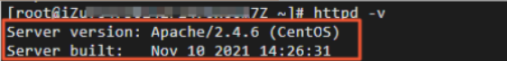

 

执行如下命令，启动Apache服务。

systemctl start httpd.service

 

 

 

在Chromium网页浏览器的址栏中，访问http://ECS公网地址。

 

说明 ：您需要将ECS公网地址替换为云产品资源列表中的ECS公网地址。

若返回页面如下图所示，说明Apache服务启动成功。

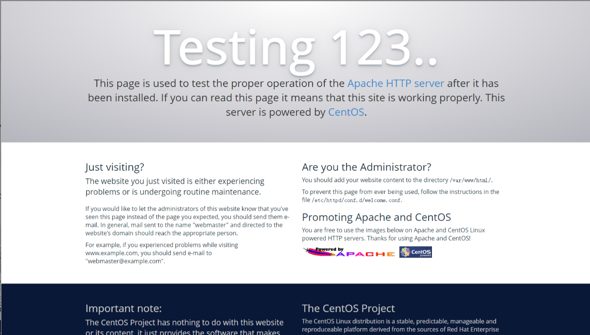

## 3、安装MariaDB数据库

由于使用WordPress搭建云上博客，需要使用MySQL数据库存储数据。本步骤将指导您如何在ECS实例上安装MySQL的开源替代品MariaDB（MariaDB兼容MySQL），并创建博客数据库。

 

 

执行如下命令，安装MariaDB Server。

 

yum install -y mariadb-server

返回如下命令，表示您已安装完成MariaDB Server。

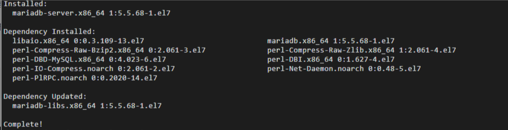

 

执行如下命令，启动MariaDB Server。

 

systemctl start mariadb

 

执行如下命令，查看MariaDB Server运行状态。

 

systemctl status mariadb

返回结果如下，您可以看到active (running)时，表示MariaDB Server启动成功。

 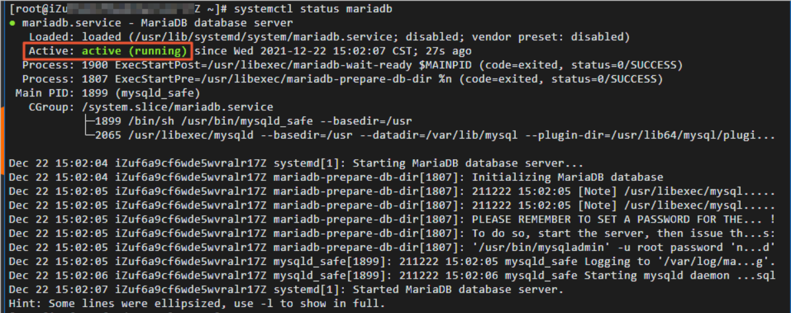

执行如下命令，设置数据库root用户的初始密码。

 

mysqladmin -u root -p password

返回如下结果，由于您是第一次设置数据库密码，因此在出现Enter Password提示符的时，直接回车即可。

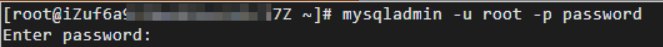

返回如下结果，输入新密码为123456789，回车后再次输入123456789即可。（输入的密码不会显示出来，这是正常的，没有出错）

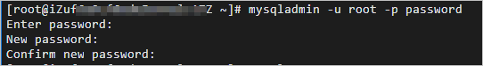

 

执行如下命令，连接数据库。

 

mysql -uroot -p

返回如下结果，出现Enter password提示符的时，输入root用户的密码123456789，即可登录数据库。（输入的密码是不会显示的，这是正常的，没有出错哦）

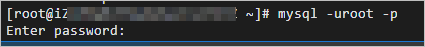

 

执行如下命令，创建WordPress数据库。

 

create database wordpress;

 

执行如下命令，查看数据库。

 

show databases;

返回结果如下，您可以看到您创建的WordPress数据库。

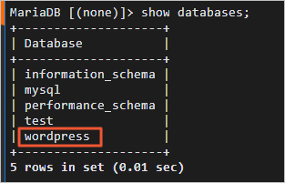

 

执行如下命令，退出数据库。

 

exit;

## 4、安装PHP

PHP是一种广泛使用的通用开源脚本语言，适合于Web网站开发，它可以嵌入HTML中。本步骤将指导您如何在ECS实例上安装并配置PHP服务。

 

执行如下命令，安装PHP。

 

yum -y install php php-mysql gd php-gd gd-devel php-xml php-common php-mbstring php-ldap php-pear php-xmlrpc php-imap

返回如下结果，表示您已安装完成PHP。

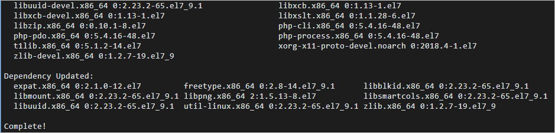

 

执行如下命令，创建PHP测试页面。

 

echo "<?php phpinfo(); ?>" > /var/www/html/phpinfo.php

 

执行如下命令，重启Apache服务。

 

systemctl restart httpd

 

在浏览器的地址栏中，访问http://<ECS公网地址>/phpinfo.php。

 

说明 ：您需要将<ECS公网地址>替换为ECS公网地址。

返回如下页面，表示PHP语言环境安装成功。

 

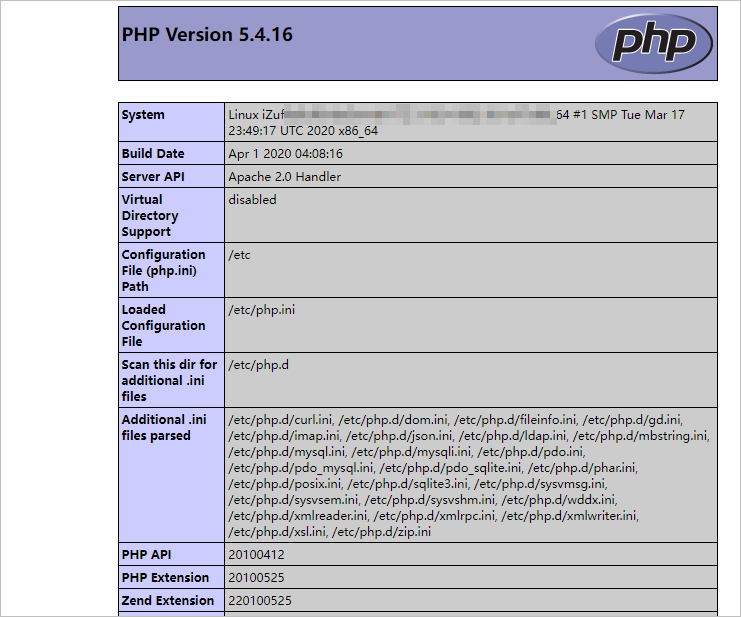

## 5、安装和配置WordPress

本步骤将指导您如何在ECS上安装和配置WordPress。

 

 

执行如下命令，安装WordPress。

 

yum -y install wordpress

返回如下结果，表示您已安装完成WordPress。

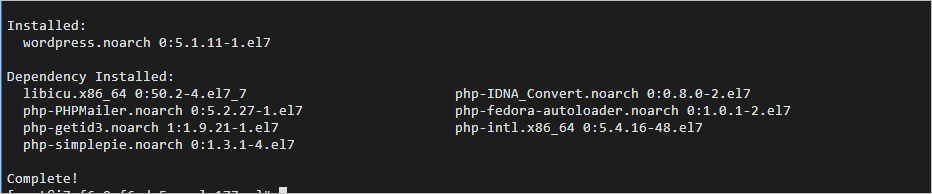

 

修改WordPress配置文件。

 

#### 5.1 执行如下命令，修改wp-config.php指向路径为绝对路径。

\# 进入/usr/share/wordpress目录。

cd /usr/share/wordpress

\# 修改路径。

ln -snf /etc/wordpress/wp-config.php wp-config.php

在安装 WordPress 后执行 ln -snf /etc/wordpress/wp-config.php wp-config.php 这个命令的目的是在 WordPress 的安装目录中创建一个符号链接（symbolic link），将 /etc/wordpress/wp-config.php 这个配置文件链接到 WordPress 的根目录下的 wp-config.php 文件。

这样做的原因是为了将 WordPress 的配置文件从 /etc/wordpress/ 移动到了 WordPress 的安装目录，同时保持配置文件的可访问性。这样，WordPress 就可以找到并读取正确的配置文件。

 

\# 查看修改后的目录结构。

#### 5.2 执行如下命令，移动wordpress文件到Apache根目录。

\# 在Apache的根目录/var/www/html下，创建一个wp-blog文件夹。

mkdir /var/www/html/wp-blog

mv * /var/www/html/wp-blog/

#### 5.3 执行以下命令，修改wp-config.php配置文件。

sed -i 's/database_name_here/wordpress/' /var/www/html/wp-blog/wp-config.php

sed -i 's/username_here/root/' /var/www/html/wp-blog/wp-config.php

sed -i 's/password_here/123456789/' /var/www/html/wp-blog/wp-config.php

#### 5.4 执行以下命令，查看配置文件信息是否修改成功。

cat -n /var/www/html/wp-blog/wp-config.php

返回如下结果，您可以看到配置文件相关信息已修改成功。

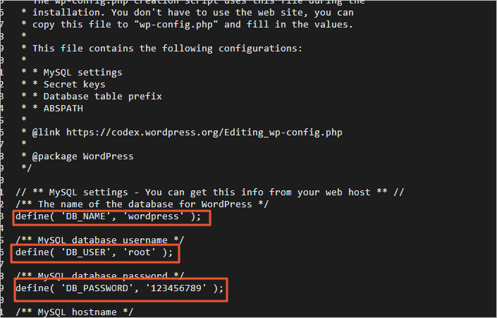

#### 5.5 执行如下命令，重启Apache服务。

systemctl restart httpd

 

## 6、测试WordPress

完成以上所有步骤后，您就可以测试基于ECS所搭建的云上博客了。

在浏览器地址栏中，访问http://<ECS公网地址>/wp-blog/wp-admin/install.php。

说明：您需要将<ECS公网地址>替换为ECS公网地址。例如：http://192.168.0.1/wp-blog/wp-admin/install.php

 

在WordPress配置页面，配置相关信息，然后单击Install WordPress。

 

参数说明：

 

Site Title：站点名称。本示例为Hello ABC。

Username：管理员用户名。本示例为admin。

Password：访问密码。本示例为Cm%c4(MKI3gQwGk8ap。 

Your Email：邮箱地址，建议使用真实有效的邮箱地址。若没有，可以填写虚拟邮箱地址，但将无法接收信息。本示例为admin@admin.com。

 

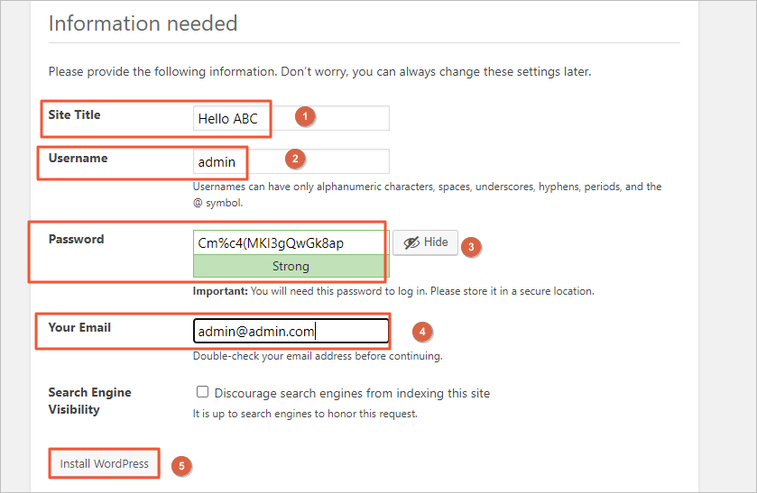

 

在Success！页面，单击Log In。

 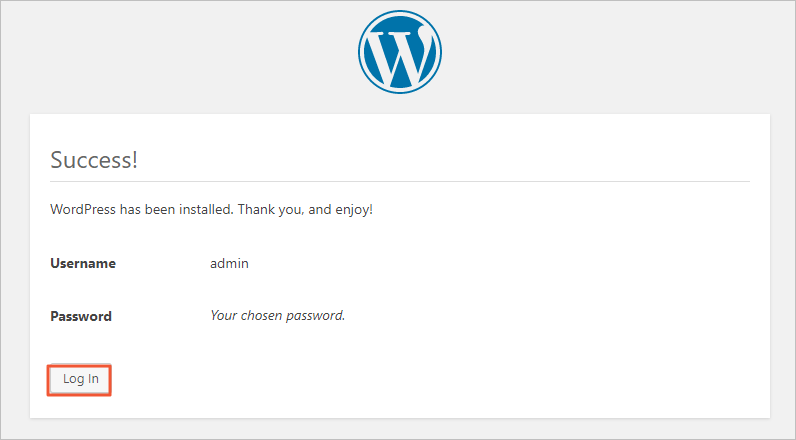

 

在登录页面，输入您的用户名和密码，单击Log In。

 

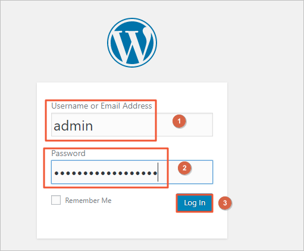

返回如下页面，表示您已成功登录博客首页，你即可进行博客发布等操作。

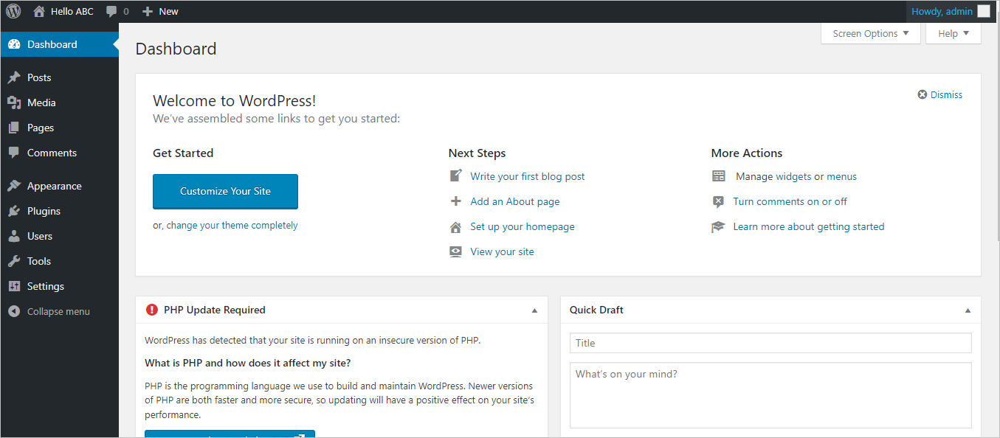
