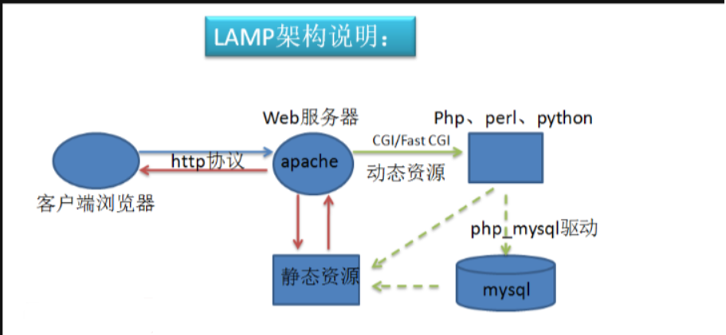

LAMP 是一种开发和运行动态Web应用程序的软件堆栈。它由四个主要组件组成，这些组件的首字母形成了 "LAMP"：

1. **Linux（操作系统）：** 作为整个堆栈的基础，Linux 提供了操作系统环境，为其他三个组件提供支持。
2. **Apache（Web服务器）：** Apache 是一个开源的Web服务器软件，负责接收和响应用户的HTTP请求。
3. **MySQL（数据库）：** MySQL 是一个开源的关系型数据库管理系统（RDBMS），用于存储和管理Web应用程序的数据。
4. **PHP（编程语言）：** PHP 是一种脚本语言，用于服务器端的Web开发。它与HTML结合使用，用于创建动态网页。

这个组合的工作方式如下：

- 用户通过浏览器发起HTTP请求。
- Apache 服务器接收请求，并根据请求的 URL 调用适当的 PHP 脚本。
- PHP 脚本与 MySQL 数据库通信，检索或修改数据。
- PHP 生成动态的 HTML 或其他格式的响应。
- Apache 将响应返回给用户的浏览器，用户在浏览器中看到动态生成的内容。

这个LAMP堆栈提供了一个强大而灵活的开发和运行Web应用程序的环境。下面是一个简单的LAMP架构图：

工作流程

1、当客户端请求的是静态资源时，web服务器会直接把静态资源返回客户端;

2、当客户端请求的是动态资源时，httpd的php模块会进行相应的动态资源运算，如果此过程还需要数据库的数据作为运算参数时，php会连接mysql取得数据然后进行运算，运算的结果转为静态资源由web服务器返回到客户端。

