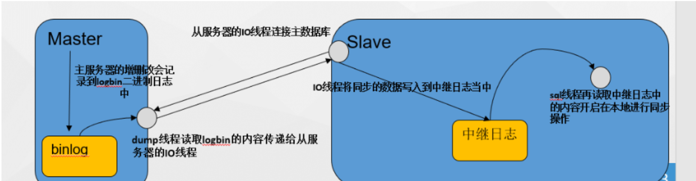

### 1.什么是mariadb数据库，它的作用是什么

### MariaDB的主要特点和作用：

1. **开源性：** MariaDB是开源软件，遵循GNU通用公共许可证（GPL）。这意味着用户可以自由地查看、修改和分发其源代码。
2. **与MySQL的兼容性：** MariaDB最初是MySQL的分支，因此它保持了与MySQL高度兼容的特性。大多数MySQL应用程序和工具都可以无缝地迁移到MariaDB。
3. **性能改进：** MariaDB包含一些性能优化的特性，例如存储引擎的优化、查询优化、缓存优化等，以提高数据库的整体性能。
4. **新特性和扩展：** MariaDB引入了一些新的功能和扩展，如动态列、JSON支持、性能模式、全文搜索等，以满足现代应用程序的需求。
5. **高可用性：** MariaDB支持主从复制、集群和其他高可用性特性，使其在构建可靠和高性能系统方面具备灵活性。
6. **安全性：** MariaDB提供了许多安全性特性，包括加密、SSL支持、身份验证插件等，以保护数据库中的敏感信息。
7. **多存储引擎支持：** MariaDB支持多种存储引擎，包括InnoDB、MyISAM、TokuDB等，允许用户选择适合其特定用例的引擎。
8. **活跃的社区支持：** 由于其开源性，MariaDB拥有一个活跃的社区，用户可以获取支持、参与讨论，并提交改进和新功能。

总体而言，MariaDB旨在提供一个强大、高性能、可靠且开放的数据库解决方案，适用于各种应用场景，从小型网站到大型企业应用。

### 2、举个例子说明mariabd的作用

假设你运行一个在线电子商务网站，你可以使用MariaDB来支持和管理你的网站的数据库。以下是一些具体的例子，说明MariaDB在这个场景中的作用：

1. **存储商品信息：** 你可以使用MariaDB来创建一个包含所有商品信息的数据库。每个商品可能有名称、描述、价格、库存等属性，这些信息可以在MariaDB数据库中存储。
2. **用户账户和身份验证：** MariaDB可以用于存储用户账户信息，包括用户名、密码（经过哈希处理）、电子邮件地址等。当用户登录网站时，你可以使用MariaDB进行身份验证。
3. **订单处理：** 当用户下订单时，订单信息可以存储在MariaDB中，包括订单号、购买的商品、交付地址等。这使得你可以有效地跟踪和管理订单。
4. **购物车管理：** MariaDB可以用于存储用户购物车中的商品信息。当用户将商品添加到购物车时，相关信息可以存储在MariaDB中，以便用户稍后查看或继续购物。
5. **交易记录：** 所有的交易记录，包括购买、退款等，可以在MariaDB数据库中进行记录。这有助于保持订单的准确性和透明度。
6. **库存管理：** 你可以使用MariaDB来跟踪每种商品的库存水平。当有商品售出时，相应的库存数量会在MariaDB中更新。
7. **用户分析和报告：** MariaDB可以用于存储用户活动数据，如页面浏览、点击、购买历史等。这些数据可以用于生成报告，帮助你了解用户行为和优化网站体验。
8. **备份和恢复：** MariaDB提供了备份和恢复功能，以确保你的数据在意外故障或数据丢失时可以迅速恢复。

总体而言，MariaDB在电子商务网站中的作用是提供一个可靠、高效的数据库系统，支持网站的核心功能，同时为数据管理、用户身份验证、交易记录等提供了强大的支持。 MariaDB的灵活性和性能优势使得它成为许多在线应用选择的数据库管理系统。

### 3.为什么要给数据库做主从同步

主从同步（Master-Slave Replication）是数据库管理中常用的一种技术，它带来了许多优势，这些优势是为了提高数据库系统的可用性、性能、灾备和负载均衡等方面。以下是一些主从同步的常见原因和优势：

1. **高可用性：** 通过主从同步，可以实现数据库的高可用性。当主数据库发生故障或不可用时，可以快速切换到从数据库，确保系统的持续运行。
2. **负载均衡：** 主从同步可以分担主数据库的读负载，将读请求分发到多个从数据库上，从而提高整体系统的性能和响应速度。
3. **数据备份和恢复：** 从数据库可以用于实时数据备份，而不影响主数据库的性能。在发生数据丢失或损坏的情况下，可以通过从数据库进行快速恢复。
4. **灾备和容错：** 主从同步提供了灾备性，即使主数据库所在的数据中心发生故障，从数据库仍然可以提供服务，确保业务的持续运行。
5. **实时分析和报告：** 通过主从同步，可以在从数据库上执行实时的数据分析和报告生成，而不会影响主数据库的性能。
6. **系统升级和维护：** 在进行系统升级或维护时，可以通过切换到从数据库来避免对主数据库的影响。这样可以实现零停机时间维护。
7. **异地数据复制：** 主从同步可以在异地复制数据，实现地理位置之间的数据同步，确保在不同地理区域的用户都可以获得相同的数据。

总体而言，主从同步是一种强大的数据库复制技术，可以提高系统的稳定性、可用性和性能。然而，在设计和配置主从同步时，需要仔细考虑业务需求、网络稳定性和数据一致性等因素，以确保系统能够以最佳状态运行。

**同步复制**（Synchronous Replication）：

- 在同步复制中，主服务器（master）将事务发送到从服务器（slave）并等待从服务器确认收到事务后再继续。
- 这确保了主服务器和从服务器之间的数据一致性，但也可能影响性能，因为主服务器需要等待确认。
- -- 在主服务器上设置同步复制
  CHANGE MASTER TO
    MASTER_SYNC_COORDINATION = 1;
- -- 在从服务器上设置同步复制
  SET GLOBAL SYNC_MASTER_INFO = 1;
- **异步复制**（Asynchronous Replication）：
  - 在异步复制中，主服务器将事务发送到从服务器，但不等待确认，而是立即继续处理下一个事务。
  - 这提高了主服务器的性能，但可能导致主从服务器之间的数据稍有延迟。
  - -- 在主服务器上设置异步复制
    CHANGE MASTER TO
      MASTER_SYNC_COORDINATION = 0;
  - -- 在从服务器上设置异步复制
    SET GLOBAL SYNC_MASTER_INFO = 0;

### 4、数据库管理中常用的还有哪些技术

大多数数据库管理技术的确是为了实现高可用性、负载均衡、数据备份、灾备和容错等目标而设计的。这些目标是数据库管理的核心原则，旨在确保数据库系统能够持续、稳定地提供服务，并在面对各种可能的故障和问题时具有恢复和容错的能力。

1. **索引优化：** 通过在数据库表上创建适当的索引，可以提高查询性能。常见的索引类型包括单列索引、多列索引、唯一索引等。
2. **查询优化：** 通过分析和调整数据库查询语句，使用合适的查询计划、合理的连接方式，以及避免全表扫描等方式，优化查询性能。
3. **分区表：** 将大表按照某个规则划分为多个子表，可以提高查询和维护的效率。分区表对于处理大量数据的场景非常有用。
4. **存储过程和触发器：** 存储过程是一组预编译的SQL语句，可以在数据库中执行，减少了网络开销。触发器是在特定事件发生时自动执行的一组SQL语句，通常用于维护数据的完整性。
5. **数据库缓存：** 使用缓存机制，将经常访问的数据存储在内存中，减少对磁盘的访问，提高数据读取速度。常见的缓存工具包括Redis和Memcached。
6. **数据库复制和高可用性：** 除了主从复制，还有其他复制和高可用性方案，如数据库集群、自动故障转移、数据分片等，以确保数据库的稳定性和可用性。
7. **事务管理：** 通过事务机制，确保数据库操作的原子性、一致性、隔离性和持久性（ACID属性）。这包括使用事务控制语句、设置事务隔离级别等。
8. **数据库安全：** 实施数据库访问控制、加密、审计和身份验证等安全措施，以确保数据库中的敏感数据得到保护。
9. **备份和恢复：** 定期备份数据库以防止数据丢失，实施恢复策略以在灾难发生时迅速还原数据库。备份可以是完整备份、增量备份或差异备份。
10. **数据仓库和数据挖掘：** 数据仓库是专门用于分析和报告的数据库，数据挖掘是通过模型和算法在大数据集中发现关联和模式的过程。
11. **数据库性能监控：** 使用性能监控工具来实时监测数据库的性能，收集关键指标，并进行分析，以及时发现和解决性能问题。
12. **NoSQL数据库：** 在某些场景下，NoSQL数据库（如MongoDB、Cassandra等）被用于存储和处理大规模、非结构化或半结构化数据。