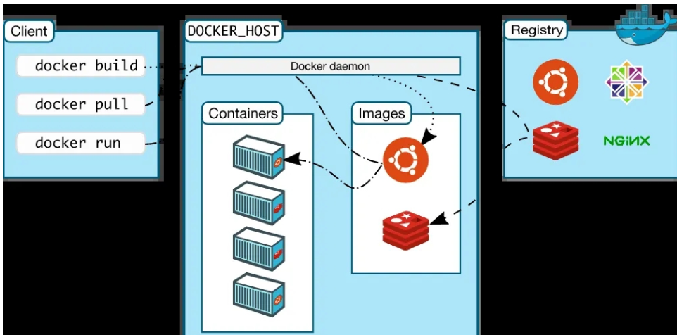

## Docker 简介

想象一下 Docker 就像是一艘巨型的货船。这艘货船有着自己的船体和引擎，而船上的货物就相当于你的应用程序及其所有依赖。以下是一些比方：

1. **集装箱（Containers）：** 在 Docker 里，这就像是船上的集装箱，每个集装箱都装有一个独立的货物（应用程序及其依赖）。这确保了货物不会互相影响，就像在集装箱里隔离了不同类型的商品。
2. **Docker 镜像（Docker Images）：** Docker 镜像就像是制造集装箱的模具。它包含了一切你的应用程序需要的，从操作系统到你的应用程序和它的所有依赖。这就好比模具定义了集装箱的形状和结构。
3. **Docker 客户端和服务器：** Docker 客户端就像是货船的船长，你通过它给予指令。而 Docker 服务器则是实际执行指令的工作人员，负责管理和运行所有的集装箱。
4. **Docker Compose：** Docker Compose 就像是一个调度员，它负责协调多个货船之间的运输，确保它们在同一个港口协同工作。
5. **Docker Registry：** Docker Registry 就像是货物的仓库，你可以将你的集装箱存储在这里，也可以从这里取出别人分享的集装箱。这就好比货物在港口的仓库中存放和检索。

Docker 是一种开源平台，用于轻松创建、部署和运行应用程序。它使用容器技术，允许开发者将应用程序及其所有依赖项打包到一个可移植的容器中。以下是 Docker 服务的主要特点和组成部分：

1. **容器化技术：** Docker 使用容器技术，将应用程序及其依赖项打包到一个称为容器的独立单元中。每个容器是一个可执行的软件包，包括代码、运行时、系统工具、系统库和设置。
2. **轻量级和快速：** Docker 容器相对于传统虚拟机来说更为轻量级，因为它们共享主机系统的内核，并在其上运行一个独立的用户空间。这使得容器更加快速启动和停止，并占用更少的系统资源。
3. **跨平台性：** Docker 容器是可移植的，可以在开发环境、测试环境和生产环境之间轻松移植。Docker 提供了一致的运行时环境，确保应用程序在任何地方都能够一致地运行。
4. **Docker 镜像：** Docker 镜像是容器的基础，它包含了应用程序及其所有依赖项。镜像可以被分享、存储在仓库中，并在需要时被加载到容器中。
5. **Docker 客户端和守护进程：** Docker 通过客户端-服务器体系结构工作。Docker 客户端负责与用户交互，而 Docker 守护进程则负责管理容器的创建、运行和停止。
6. **Docker Compose：** Docker Compose 是一个用于定义和运行多容器 Docker 应用程序的工具。通过简单的 YAML 文件，可以定义应用程序的服务、网络和卷等配置。
7. **Docker Swarm：** Docker Swarm 是 Docker 提供的集群管理和编排工具，允许用户在多个主机上运行和管理容器服务。
8. **Docker Hub：** Docker Hub 是一个集中存储和分享 Docker 镜像的在线仓库。开发者可以在 Docker Hub 上找到各种公共和官方的 Docker 镜像，也可以将自己的镜像存储在其中。

通过使用 Docker，开发者能够更容易地构建、交付和运行应用程序，减少了在不同环境中部署应用程序时的问题，提高了开发和运维的效率。 Docker 已成为现代应用程序开发和部署的标准之一。

# 组件的基本关系和互动过程

1. **Client（客户端）：**
   - Docker 客户端是与用户交互的命令行工具或通过 Docker API 进行通信的程序。用户可以使用 Docker 客户端来执行各种 Docker 命令，如构建镜像、运行容器等。
2. **docker build：**
   - `docker build` 命令用于构建 Docker 镜像。通过提供一个 Dockerfile（定义容器内部设置和操作的脚本），该命令会将应用程序及其依赖项打包成一个镜像。
3. **docker pull：**
   - `docker pull` 命令用于从远程 Docker 镜像仓库（如 Docker Hub）中拉取已有的镜像到本地环境。这是在本地计算机获取镜像的方式。
4. **docker run：**
   - `docker run` 命令用于在容器中运行一个镜像。通过此命令，你可以创建并启动一个新的容器实例，并指定容器的各种配置选项，如端口映射、环境变量等。
5. **DOCKER_HOST：**
   - `DOCKER_HOST` 是一个环境变量，用于指定 Docker 客户端连接到的 Docker 守护进程的主机和端口。它允许你远程连接到其他主机上运行的 Docker 守护进程。
6. **Containers（容器）：**
   - 容器是 Docker 中的基本运行单元，它包含应用程序及其依赖项，运行在隔离的环境中。容器化技术使应用程序可以在不同的环境中一致地运行。
7. **Docker daemon（Docker 守护进程）：**
   - Docker 守护进程是在主机上运行的后台进程，负责管理 Docker 容器的创建、运行、停止等操作。它还与 Docker 客户端通信，响应用户的命令。
8. **Images（镜像）：**
   - Docker 镜像是一个轻量级、独立的可执行软件包，包含运行应用程序所需的一切，包括代码、运行时、系统工具、系统库和设置。
9. **Registry（镜像仓库）：**
   - 镜像仓库是用于存储和分享 Docker 镜像的地方。Docker Hub 是一个常用的公共镜像仓库，但你也可以搭建自己的私有仓库。

这些概念共同构成了 Docker 的基本工作原理和使用方式，使得开发者能够轻松构建、分享和运行容器化的应用程序。

