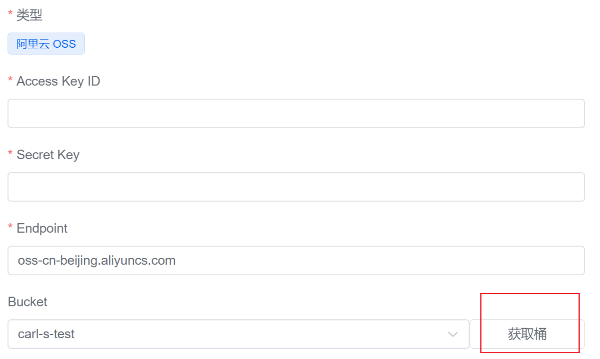

## 1、全网最新 1Panel 1.8.2 教程，遥遥领先

> 下课后，笔记，也会发给各位，最新，一手资料。

世人苦宝塔已久，后门、漏洞、隐私各类问题..

下一代开源、现代化Linux服务器运维管理面板，1Panenl来了。

今晚7:40 猿来教育Linux金牌讲师，柯里昂阁下来啦！

### 特点

- 小白，零基础，也可以学，一键安装！小菜，太白，都能学会！
- 无须苦苦掌握诸多运维技术！即可轻松运维服务器！
- 小菜开发，运维神器！
- 老运维，降压神器！


### 课程内容


- 基于Golang开发，二进制编译运行，轻松部署！
- 比起宝塔，1Panel，开源，强大！
- 1Panel适合小规模运维，单机运维管理！多机建议Jumpserver管理！
- 1Panel基于Go开发，占用内存极小！
- 1Panel基于Docker管理主流应用！对系统侵入性小！
- 热门运维应用，一键安装！
- 一键部署wordpress博客
- 遥遥领先！


## 2、1Panel 可以帮你很多

快速建站、高效管理、安全可靠、一键备份、应用商店


## 3、安装1panel

https://1panel.cn/docs/installation/online_installation/

**安装前请确保您的系统符合安装条件：**

- 操作系统：支持主流 Linux 发行版本（基于 Debian / RedHat，包括国产操作系统）；
- 服务器架构：x86_64、aarch64、armv7l、ppc64le、s390x；
- 内存要求：建议可用内存在 1GB 以上；
- 浏览器要求：请使用 Chrome、FireFox、IE10+、Edge等现代浏览器；
- **可访问互联网**。


```
curl -sSL https://resource.fit2cloud.com/1panel/package/quick_start.sh -o quick_start.sh && sh quick_start.sh

# 阿里云安全组问题


1.安装，拷贝docker命令
2.拷贝1panel二进制命令，传入服务器
3.修改配置，启动

# 于超老师机器 4G 2c
# 你练习，2g 1c vmware虚拟机练习
纯白嫖！！！
https://developer.aliyun.com/adc/scenario/exp/a7161434e6cd499e9e26f2e62d0242fb?spm=a2c6h.26876520.0.i2.887b4a91F4op13


[root@localhost ~]# 1pctl user-info
面板地址: http://$LOCAL_IP:18637/318493e80f
用户名称: b5f08fdde8
用户密码: a5cd85e8f0


```


## 4、功能实战

### 概览


## 5.一键wordpress安装


### 安装mysql


### 容器查看

```bash
[root@localhost ~]# docker images
REPOSITORY   TAG       IMAGE ID       CREATED       SIZE
mysql        8.2.0     5d2fb452c483   4 weeks ago   622MB
[root@localhost ~]#
[root@localhost ~]# docker ps
CONTAINER ID   IMAGE         COMMAND                  CREATED          STATUS          PORTS                                 NAMES
fe0865f2dbea   mysql:8.2.0   "docker-entrypoint.s…"   34 seconds ago   Up 33 seconds   127.0.0.1:3306->3306/tcp, 33060/tcp   yu-mysql
[root@localhost ~]#


```

## wordpress数据库密码


### 应用商店


### 数据库监控


### Mysql优化调整


### 安装wordpress


### 容器查看

```bash
[root@localhost ~]# docker images
REPOSITORY   TAG       IMAGE ID       CREATED        SIZE
wordpress    6.4.1     d9aabebf69e3   23 hours ago   619MB
mysql        8.2.0     5d2fb452c483   4 weeks ago    622MB

[root@localhost ~]# docker ps
CONTAINER ID   IMAGE             COMMAND                  CREATED          STATUS          PORTS                                 NAMES
13df44beaf25   wordpress:6.4.1   "docker-entrypoint.s…"   13 seconds ago   Up 13 seconds   0.0.0.0:8080->80/tcp                  yu-wordpress
fe0865f2dbea   mysql:8.2.0       "docker-entrypoint.s…"   5 minutes ago    Up 5 minutes    127.0.0.1:3306->3306/tcp, 33060/tcp   yu-mysql
[root@localhost ~]#

# 注意端口号、容器做了外部映射，可以访问
宿主机:8080 
```

### 应用商店


### 访问wordpress


KRgq)zXSjVVoqGbjYH


### 容器运维

```bash
[root@localhost ~]#
[root@localhost ~]# docker exec -it yu-wordpress bash

root@13df44beaf25:/var/www/html# cat /etc/os-release
PRETTY_NAME="Debian GNU/Linux 11 (bullseye)"
NAME="Debian GNU/Linux"
VERSION_ID="11"
VERSION="11 (bullseye)"
VERSION_CODENAME=bullseye
ID=debian
HOME_URL="https://www.debian.org/"
SUPPORT_URL="https://www.debian.org/support"
BUG_REPORT_URL="https://bugs.debian.org/"
root@13df44beaf25:/var/www/html#
root@13df44beaf25:/var/www/html#
root@13df44beaf25:/var/www/html# ps -ef
UID          PID    PPID  C STIME TTY          TIME CMD
root           1       0  0 02:58 ?        00:00:00 apache2 -DFOREGROUND
www-data      60       1  0 02:58 ?        00:00:00 apache2 -DFOREGROUND
www-data      61       1  0 02:58 ?        00:00:00 apache2 -DFOREGROUND
www-data      62       1  0 02:58 ?        00:00:00 apache2 -DFOREGROUND
www-data      63       1  0 02:59 ?        00:00:00 apache2 -DFOREGROUND
www-data      69       1  0 02:59 ?        00:00:00 apache2 -DFOREGROUND
www-data      70       1  0 02:59 ?        00:00:00 apache2 -DFOREGROUND
www-data      71       1  0 02:59 ?        00:00:00 apache2 -DFOREGROUND
www-data      77       1  0 03:00 ?        00:00:00 apache2 -DFOREGROUND
www-data     103       1  0 03:03 ?        00:00:00 apache2 -DFOREGROUND
www-data     108       1  0 03:04 ?        00:00:00 apache2 -DFOREGROUND
root         109       0  0 03:06 pts/0    00:00:00 bash
root         116     109  0 03:06 pts/0    00:00:00 ps -ef
root@13df44beaf25:/var/www/html#


```


### 数据库容器运维

```bash
[root@localhost ~]# docker exec -it yu-mysql bash
bash-4.4#
bash-4.4# cat /etc/os-release
NAME="Oracle Linux Server"
VERSION="8.8"
ID="ol"
ID_LIKE="fedora"
VARIANT="Server"
VARIANT_ID="server"
VERSION_ID="8.8"
PLATFORM_ID="platform:el8"
PRETTY_NAME="Oracle Linux Server 8.8"
ANSI_COLOR="0;31"
CPE_NAME="cpe:/o:oracle:linux:8:8:server"
HOME_URL="https://linux.oracle.com/"
BUG_REPORT_URL="https://github.com/oracle/oracle-linux"

ORACLE_BUGZILLA_PRODUCT="Oracle Linux 8"
ORACLE_BUGZILLA_PRODUCT_VERSION=8.8
ORACLE_SUPPORT_PRODUCT="Oracle Linux"
ORACLE_SUPPORT_PRODUCT_VERSION=8.8
bash-4.4#
bash-4.4#
bash-4.4# env
HOSTNAME=fe0865f2dbea
MYSQL_ROOT_PASSWORD=mysql_S7C2JG
PWD=/
HOME=/root
MYSQL_MAJOR=innovation
GOSU_VERSION=1.16
MYSQL_VERSION=8.2.0-1.el8
TERM=xterm
SHLVL=1
PATH=/usr/local/sbin:/usr/local/bin:/usr/sbin:/usr/bin:/sbin:/bin
MYSQL_SHELL_VERSION=8.0.35-1.el8
_=/usr/bin/env
bash-4.4#
bash-4.4# mysql -uroot -pmysql_S7C2JG
mysql: [Warning] Using a password on the command line interface can be insecure.
Welcome to the MySQL monitor.  Commands end with ; or \g.
Your MySQL connection id is 135
Server version: 8.2.0 MySQL Community Server - GPL

Copyright (c) 2000, 2023, Oracle and/or its affiliates.

Oracle is a registered trademark of Oracle Corporation and/or its
affiliates. Other names may be trademarks of their respective
owners.

Type 'help;' or '\h' for help. Type '\c' to clear the current input statement.

mysql>
```


## 6.服务器运维

### 文件管理


### 负载监控


### 网页ssh终端


# 7.服务器通过阿里云OSS对象存储备份

### 获取到自己的AK和SK


### 点击添加阿里云的云存储


### 获取到OSS的bucket列表


### 把获取到的信息输入到编辑备份账号


### 创建bucket并开启版本控制功能


### 最后就点击获取桶




### 防火墙

未完待续...

### 进程

未完待续...

### SSH安全优化

未完待续...

### 日志运维

未完待续...

## 更多内容，敬请期待...


## 作业

1. 部署好1panel
2. 完成wordpress、halo、mysql、的部署，使用
3. 额外，部署phpmyadmin，mysql数据库可视化运维管理


签到，打卡时间，微信群打卡，评论区打卡，听课记录。

carlos讲师2分钟后回来分享，超级nice，云计算高薪offer喜报，小白们，都是怎么学，怎么就业的。。。


