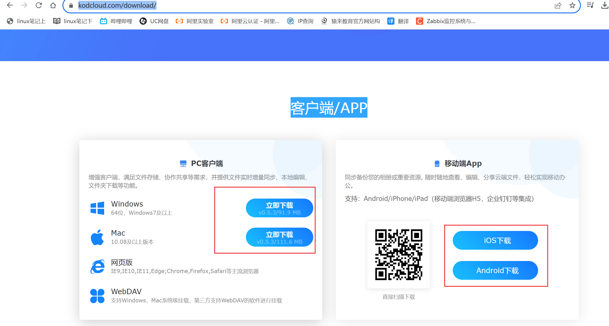
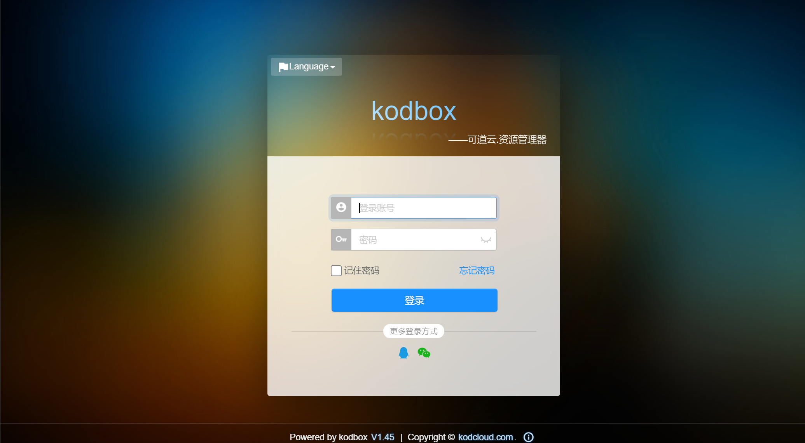
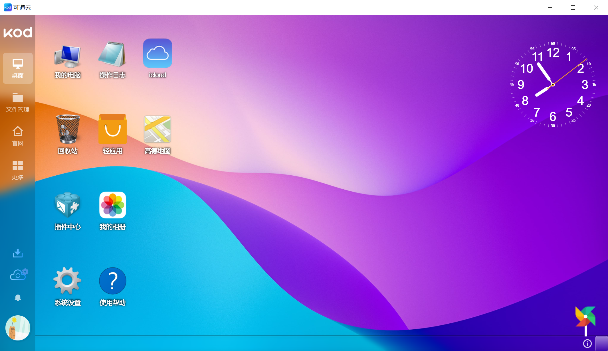
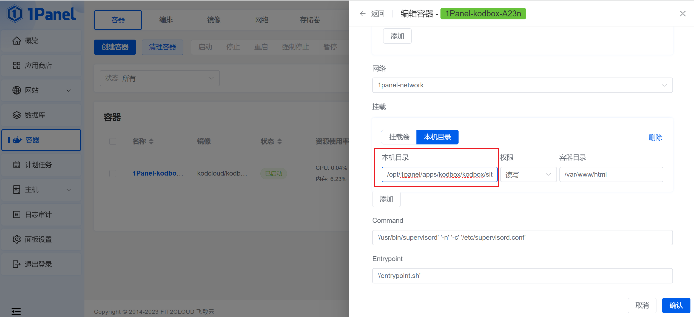
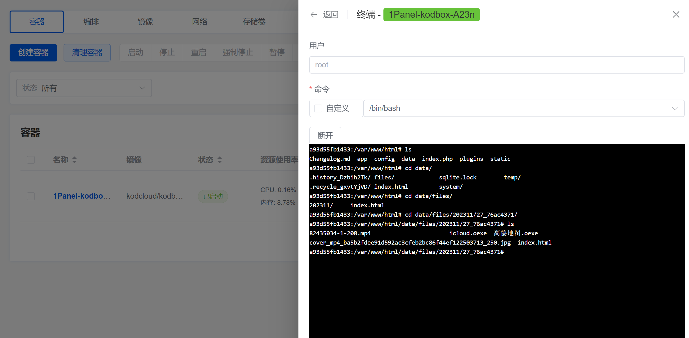
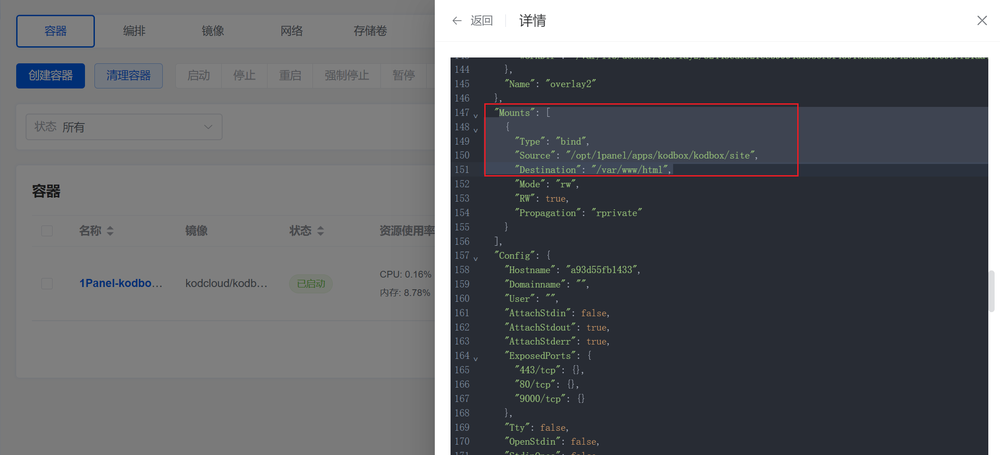

## 1、全网最新 1Panel 1.8.2 教程，遥遥领先

> 下课后，笔记，也会发给各位，最新，一手资料。

世人苦宝塔已久，后门、漏洞、隐私各类问题..

下一代开源、现代化Linux服务器运维管理面板，1Panenl来了。

今晚7:40 猿来教育Linux学科创始人，linux超哥辣个男人来啦！

### 特点

- 小白，零基础，也可以学，一键安装！小菜，太白，都能学会！
- 无须苦苦掌握诸多运维技术！即可轻松运维服务器！
- 小菜开发，运维神器！
- 老运维，降压神器！


### 课程内容

宝塔，lamp ,httpd,mysql,php

go build 1panle.go   -o 1panle


./ls

./pwd

./1panle


- 基于Golang开发，二进制编译运行，轻松部署！`gin+vue.js 开发模式`
- 比起宝塔，1Panel，开源，强大！
- 1Panel适合小规模运维，单机运维管理！多机建议Jumpserver管理！
- 1Panel基于Go开发，占用内存极小！
- 1Panel基于Docker管理主流应用！对系统侵入性小！
- 热门运维应用，一键安装！
- 一键部署wordpress博客
- 遥遥领先！


## 2、1Panel 可以帮你很多

快速建站、高效管理、安全可靠、一键备份、应用商店


## 3、安装1panel

https://1panel.cn/docs/installation/online_installation/

**安装前请确保您的系统符合安装条件：**

- 操作系统：支持主流 Linux 发行版本（基于 Debian / RedHat，包括国产操作系统）；
- 服务器架构：x86_64、aarch64、armv7l、ppc64le、s390x；
- 内存要求：建议可用内存在 1GB 以上；
- 浏览器要求：请使用 Chrome、FireFox、IE10+、Edge等现代浏览器；
- **可访问互联网**。


```
curl -sSL https://resource.fit2cloud.com/1panel/package/quick_start.sh -o quick_start.sh && sh quick_start.sh

# 阿里云安全组问题


1.安装，拷贝docker命令
2.拷贝1panel二进制命令，传入服务器
3.修改配置，启动

# 于超老师机器 4G 2c
# 你练习，2g 1c vmware虚拟机练习
# win10 + vmware + xshell 和我一样的操作


[root@localhost ~]# 1pctl user-info
面板地址: http://$LOCAL_IP:18637/318493e80f
用户名称: b5f08fdde8
用户密码: a5cd85e8f0


```


## 4、功能实战

### 概览


## 5.一键kodbox安装


6、可道云客户端/APP安装

https://kodcloud.com/download/





输入自定义的账号密码



可以正常测试上传下载文件以及外链生成



查看本机目录



查看他们的挂载关系



Docker 提供了多种挂载（或称为绑定挂载）方式，允许将宿主机上的文件或目录与容器中的文件系统进行关联。以下是一些常见的 Docker 挂载方式：

1. **绑定挂载（Bind Mounts）：**

   - 使用宿主机文件系统中的特定路径将文件或目录挂载到容器内。

   - 通过在运行 

     ```
     docker run
     ```

      命令时使用 

     ```
     -v
     ```

      或 

     ```
     --volume
     ```

      参数实现。例如：

     ```
     bashCopy code
     docker run -v /host/path:/container/path my_image
     ```

2. **命名卷（Named Volumes）：**

   - Docker 提供了一种更为抽象的数据卷概念，可以使用命名卷将数据保存在宿主机的指定位置。

   - 使用 

     ```
     -v
     ```

      或 

     ```
     --volume
     ```

      参数，但指定的路径是一个卷的名称而不是宿主机上的路径。例如：

     ```
     javascriptCopy code
     docker run -v my_volume:/container/path my_image
     ```

3. **临时文件系统（tmpfs）挂载：**

   - 使用 `--tmpfs` 参数可以将一个临时的 tmpfs 文件系统挂载到容器的指定路径上，这是一个在内存中存储的文件系统。

   - 例如：

     ```
     arduinoCopy code
     docker run --tmpfs /container/path my_image
     ```

这些挂载方式可以根据应用程序的需要进行选择。绑定挂载是最灵活的，但需要注意在不同主机上的路径可能会有差异。命名卷提供了更为抽象和可移植的方式来管理数据。临时文件系统挂载适用于需要在容器内使用临时存储的情况。


docker container inspect 容器ID 查看详细信息

## 更多内容，敬请期待...


## 作业

1. 部署好1panel

2. 搭建私人的网盘

   

签到，打卡时间，微信群打卡，评论区打卡，听课记录。

carlos讲师2分钟后回来分享，超级nice，云计算高薪offer喜报，小白们，都是怎么学，怎么就业的。。。


